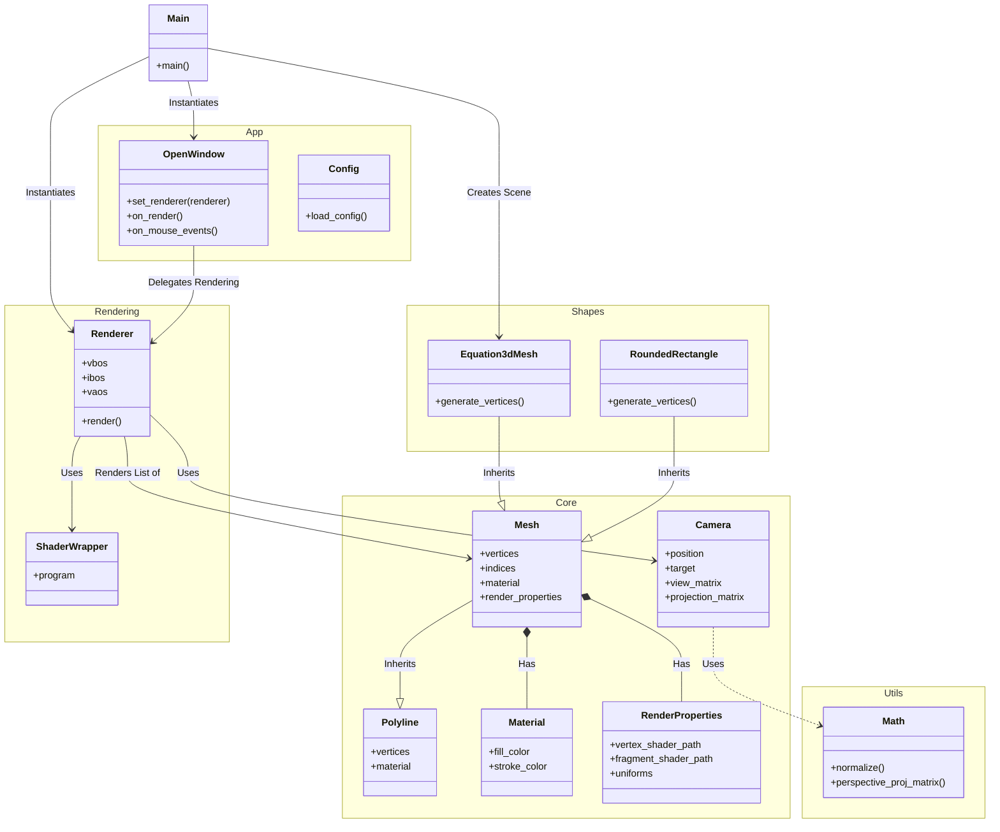

# PyXion Architecture

This document outlines the high-level architecture of the PyXion application after refactoring.

## Component Diagram

## Module Description

- **Core**: Contains the fundamental data structures (`Mesh`, `Material`) and logic (`Camera`) that are independent of the rendering engine or application window.
- **Rendering**: Handles the interaction with ModernGL. The `Renderer` takes `Mesh` objects and draws them using `ShaderWrapper`.
- **Shapes**: Concrete implementations of `Mesh` for specific geometries like mathematical surfaces or UI primitives.
- **App**: Manages the windowing system (using `moderngl_window`) and user input events.
- **Utils**: Pure mathematical helpers and configuration loaders.
